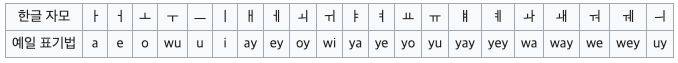
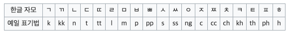
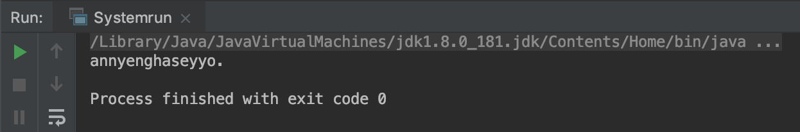

# 예일 로마자 표기법(Yale romanization of Korean)
-----------
이 문서는 언어학에서 한글을 로마자로 표기 할 때 표준으로 사용되는 예일 로마자 표기법을 Java에서 쉽게 변환 하기 위해 개발된 라이브러리 배포를 목적으로 한다.

## 목차(Table of contents)
* [예일 로마자란?](#general-info)
* [표기 방법](#writing)
* [라이브러리](#library)
* [사용법](#use)
* [출력결과](#result)
* [참고](#reference)

<a name="general-info"></a>
## 예일 로마자란?
-----------
예일대에서 만든 예일 로마자 표기법은 McCune–Reischauer 이후 약 반년 후에 Samuel Elmo Martin과 그의 동료들에 의해 완성되었다. 현재는 언어학에서 한국어를 표기하는 표준 로마자로 사용되고 있다.
더 자세한 설명은 [Wikipedia_kr](https://ko.wikipedia.org/wiki/%EC%98%88%EC%9D%BC_%EB%A1%9C%EB%A7%88%EC%9E%90_%ED%91%9C%EA%B8%B0%EB%B2%95)과 [Wikipedia_eng](https://en.wikipedia.org/wiki/Yale_romanization_of_Korean)를 참고하시기 바랍니다.

<a name="writing"></a>
## 표기 방법
-----------
예일 로마자 표기법은 각각의 자모를 위치에 관계없이 동일한 로마자로 표기한다. 자모와 로마자의 대조표는 다음과 같다.

<a name="vowel"></a>
### 모음(Vowels)
<div>
  </img>
</div>

<a name="consonant"></a>
### 자음(Consonants) 
<div>
  </img>
</div>

<a name="library"></a>
## 라이브러리(Java library) 
-----------
예일 로마자 표기법을 위해 Java를 기반으로 개발된 라이브러리는 아래의 링크를 통해 다운로드 할 수 있다.
[Java library](https://ko.wikipedia.org/wiki/%EC%98%88%EC%9D%BC_%EB%A1%9C%EB%A7%88%EC%9E%90_%ED%91%9C%EA%B8%B0%EB%B2%95)과 [Wikipedia_eng](https://en.wikipedia.org/wiki/Yale_romanization_of_Korean)

<a name="use"></a>
## 사용법(How to use?) 
-----------
```
import java.io.IOException;

import static translator.Romanization.yale_romanization;

public class Systemrun {
    public static void main (String [] args) throws IOException {
        System.out.println(yale_romanization("안녕하세요."));
    }
}
```

<a name="result"></a>
## 출력결과(output) 
-----------
<div>
  </img>
</div>

<a name="reference"></a>
## 참고(reference) 
-----------
- Martin, Samuel E. (1992). "Yale Romanization". A Reference Grammar of Korean. Rutland, VT and Tokyo: Charles E. Tuttle Publishing. pp. 8–12. ISBN 0-8048-1887-8.
- Sohn, Ho-Min (2001). The Korean Language. Cambridge University Press. pp. 1–4. ISBN 978-0-521-36943-5.


